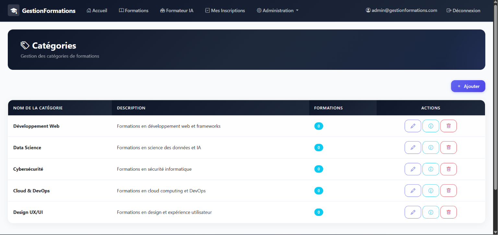
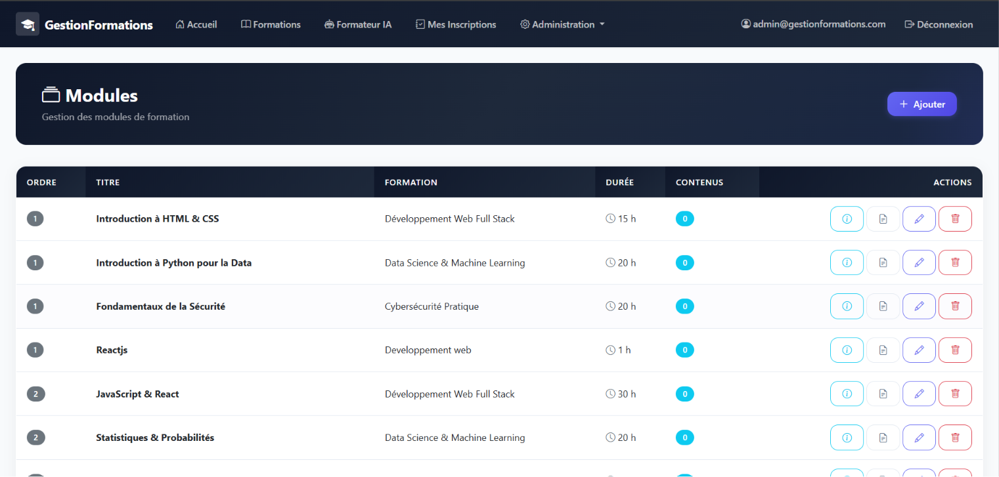
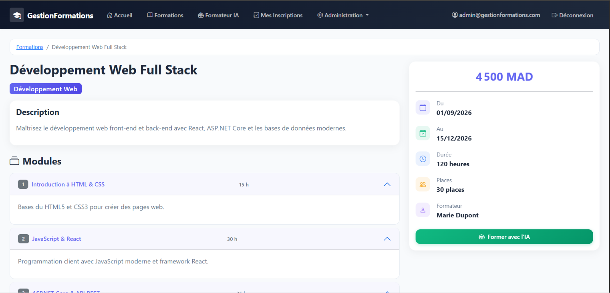
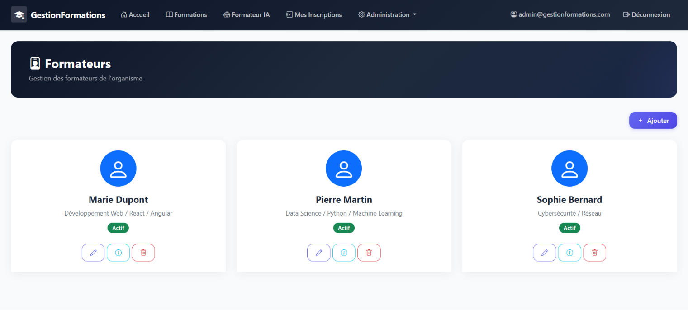
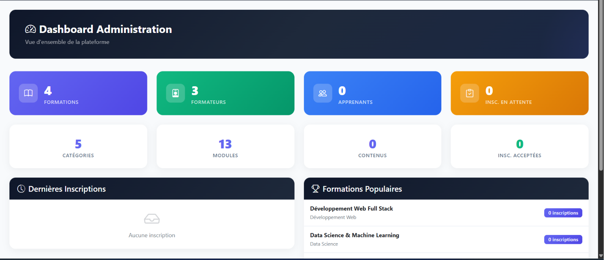
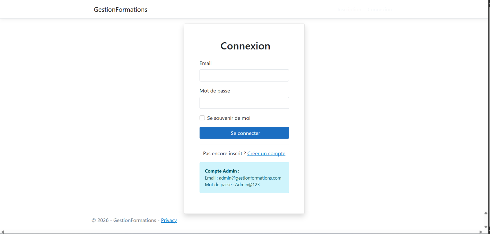

# GestionFormations

Plateforme de gestion des formations en ligne avec formateur IA intégré. Construite avec ASP.NET Core 8, Entity Framework Core (SQLite) et ASP.NET Identity.

## Fonctionnalités

### Gestion des formations
- Catalogue de formations avec catégories, formateurs, tarifs et places
- Inscriptions des apprenants avec validation par un admin
- Suivi des inscriptions (en attente, acceptée, refusée, terminée)

### Gestion pédagogique
- Modules rattachés à une formation avec ordre et durée
- Contenus variés : Cours, Exercices, Quiz, Examens, Vidéos, Documents
- Questions avec choix de réponses pour les quiz/examens
- Système de notation et de résultats

### Formateur IA (Anam.ai)
- Avatar IA interactif avec voice et vidéo en temps réel
- Sélection automatique de la formation et du module
- Présentation contextuelle du contenu pédagogique
- Conversation vocale pour poser des questions

### Administration
- Dashboard avec statistiques (formations, apprenants, inscriptions)
- Gestion complète CRUD de toutes les entités
- Rôles : Admin, Formateur, Apprenant

## Architecture

```
GestionFormations/
├── Controllers/          # API et contrôleurs MVC
│   ├── AdminController.cs
│   ├── AiTrainerController.cs
│   ├── FormationsController.cs
│   ├── ModulesController.cs
│   ├── ContenusController.cs
│   ├── CategoriesController.cs
│   ├── FormateursController.cs
│   ├── QuestionsController.cs
│   ├── QuizController.cs
│   ├── InscriptionsController.cs
│   └── AdminInscriptionsController.cs
├── Models/               # Entités EF Core
│   ├── Formation.cs
│   ├── Module.cs
│   ├── Contenu.cs
│   ├── Question.cs
│   ├── ChoixReponse.cs
│   ├── Categorie.cs
│   ├── Formateur.cs
│   ├── Apprenant.cs
│   └── Inscription.cs
├── Data/
│   ├── ApplicationDbContext.cs
│   └── SeedData.cs
├── Views/                # V Razor (MVC + Razor Pages)
├── wwwroot/              # CSS, JS, librairies
├── Program.cs
└── appsettings.json
```

## Technologies

| Technologie | Version |
|-------------|---------|
| .NET | 8.0 |
| ASP.NET Core MVC | 8.0 |
| Entity Framework Core | 8.0 |
| SQLite | - |
| ASP.NET Identity | 8.0 |
| Bootstrap | 5.x |
| Anam AI SDK | JavaScript (esm.sh) |

## Prérequis

- [.NET 8 SDK](https://dotnet.microsoft.com/download/dotnet/8.0)
- [Anam AI Account](https://lab.anam.ai) (pour le formateur IA)

## Installation

### 1. Cloner le projet

```bash
git clone https://github.com/votre-repo/dotnet-anam-2.git
cd dotnet-anam-2/GestionFormations
```

### 2. Restaurer les dépendances

```bash
dotnet restore
```

### 3. Configurer Anam AI

Dans `appsettings.json`, configurez vos clés Anam AI :

```json
{
  "AnamAi": {
    "ApiKey": "votre-api-key",
    "PersonaId": "votre-persona-id"
  }
}
```

Pour obtenir ces clés :
1. Créez un compte sur [lab.anam.ai](https://lab.anam.ai)
2. Créez un **Persona** (avatar, voix, personnalité)
3. Copiez le **Persona ID** depuis les paramètres
4. Créez une **API Key** depuis l'onglet API Keys
5. Dans l'onglet Widget → **Allowed domains**, ajoutez `localhost`

### 4. Lancer l'application

```bash
dotnet run
```

L'application démarre sur `http://localhost:5268` (ou le port configuré).

### 5. Docker (optionnel)

```bash
docker-compose up --build
```

L'application sera accessible sur `http://localhost:5000`.

## Données initiales

Le projet inclut un seed data automatique avec :
- **Catégories** : Développement Web, Data Science, Cybersécurité, Cloud & DevOps, Design UX/UI
- **Comptes** :
  - Admin : `admin@formations.com` / `Admin123!`
  - Formateur : `formateur@formations.com` / `Formateur123!`
  - Apprenant : `apprenant@formations.com` / `Apprenant123!`

## Utilisation

### Apprenant
1. Créer un compte ou se connecter
2. Parcourir le catalogue de formations
3. S'inscrire à une formation
4. Suivre les modules et contenus
5. Passer les quiz et examens
6. Utiliser le Formateur IA pour réviser

### Formateur
1. Se connecter avec un compte formateur
2. Consulter les inscriptions
3. Accéder au Formateur IA

### Admin
1. Dashboard avec statistiques
2. Gérer les formations, modules, contenus
3. Gérer les catégories et formateurs
4. Valider ou refuser les inscriptions
5. Gérer les questions et quiz

## Configuration Anam AI

Le formateur IA utilise l'Anam AI JavaScript SDK :

```javascript
import { createClient } from "@anam-ai/js-sdk";

const client = createClient(sessionToken);
await client.streamToVideoElement("video-element-id");
```

Le flow :
1. Le client demande un **session token** au serveur (endpoint `/AiTrainer/CreateSessionToken`)
2. Le serveur échange la **API key** pour un token temporaire via l'API Anam
3. Le SDK initialise la session et affiche l'avatar vidéo
4. Le contexte du module est envoyé via `addContext()` + `sendUserMessage()`

## Structure de la base de données

```
Categories ─< Formations ─< Modules ─< Contenus
                    │                    └───< Questions ─< ChoixReponse
                    └───< Inscriptions
Formateurs ─< Formations
Apprenants ─< Inscriptions
```

## Screenshots

### Catalogue des Formations


### Catalogue des Modules


### Détail d'une Formation avec ses Modules


### Formateur IA


### Formateur 


### Dashboard Admin


### Page de Login


## Licences

Ce projet utilise les librairies suivantes :
- [ASP.NET Core](https://github.com/dotnet/aspnetcore) - MIT
- [Entity Framework Core](https://github.com/dotnet/efcore) - MIT
- [Bootstrap](https://github.com/twbs/bootstrap) - MIT
- [Anam AI JS SDK](https://github.com/anam-org/anam-agent-widget) - MIT
